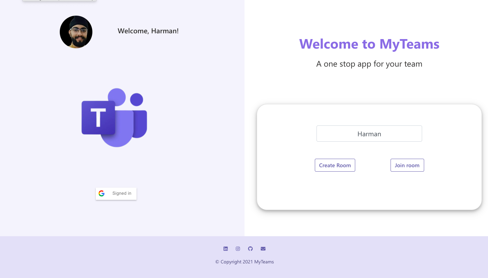
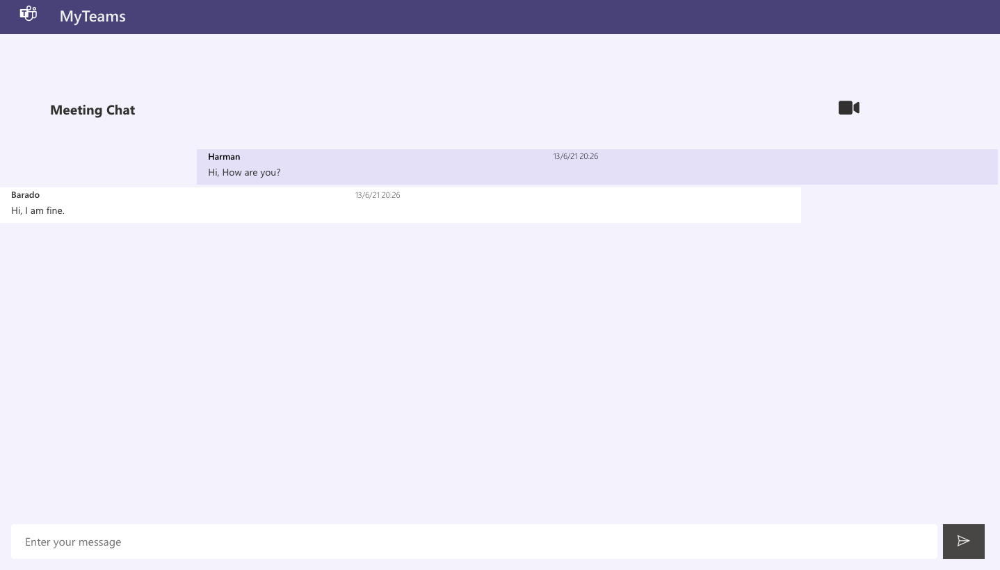
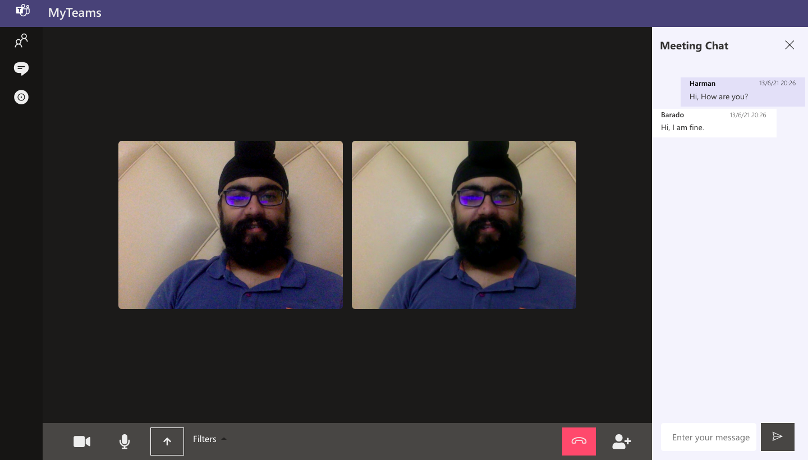

# My Teams (MS Engage 2021)

Welcome to MyTeams! A one stop app for your team.

Website Link : https://msteamsengagesite.herokuapp.com/

Video Link : https://youtu.be/I9H5rT9aIIc

PPT Link : https://drive.google.com/file/d/1yoSTO6SZW4J9S-H66LRBeP8647zoUaOS/view?usp=sharing

# View of different pages of the web-app
- Page 1_1 
- Page 1_2 
- Page 2 
- Page 3 

# Features implemented :

- Minimum Functionality Achieved (Two people taling to each other)
- More than 2 participants can join the meeting
- Muting audio
- Stopping video stream
- OAuth using Google
- Making separate rooms so that the app can be used by any team at any point in separate rooms
- Sending invitiation through auto-generated mails
- Screen sharing
- Applying Filters
- Chat functionality (With date and time of the message sent)
- Viewing the participants present in the meeting
- Watching video in full screen, pausing someone's video
- Integrating the 'Adopt phase' : storing messages and retrieving those at the start of a meeting with the same room. Team members can chat before the meeting, during the meeting and after the meeting.

# Technologies used:
Technologies used:
- HTML
- CSS
- JavaScript
- Node.js
- ExpressJs
- ReactJS
- MongoDB
- EJS 
- Socket.io
- WebRTC
- Peer-JS library

# Agile Methodology used:
Divided the work into sprints (Each sprint lasting 5-6 days). The sprints are :
- Made a prelimnary architecture diagram and reviewed with mentor
- Explored WebRTC, its functionality along with socket.io
- Designed a basic app with WebRTC using Node.js, HTML, CSS, React, Express, EJS, etc
- Added additional features like recording, chatting, screensharing, emailing etc.
- Managed the ADOPT phase - integrated chat app with the database.

